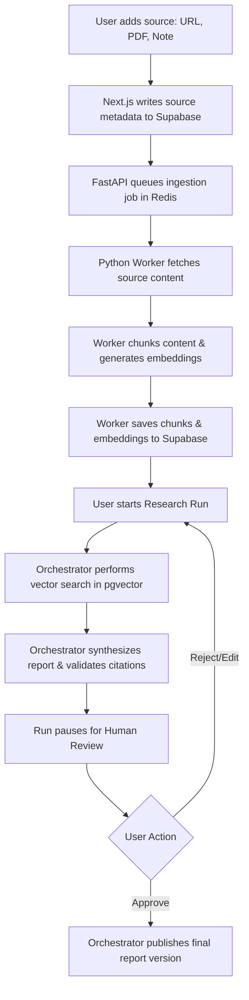
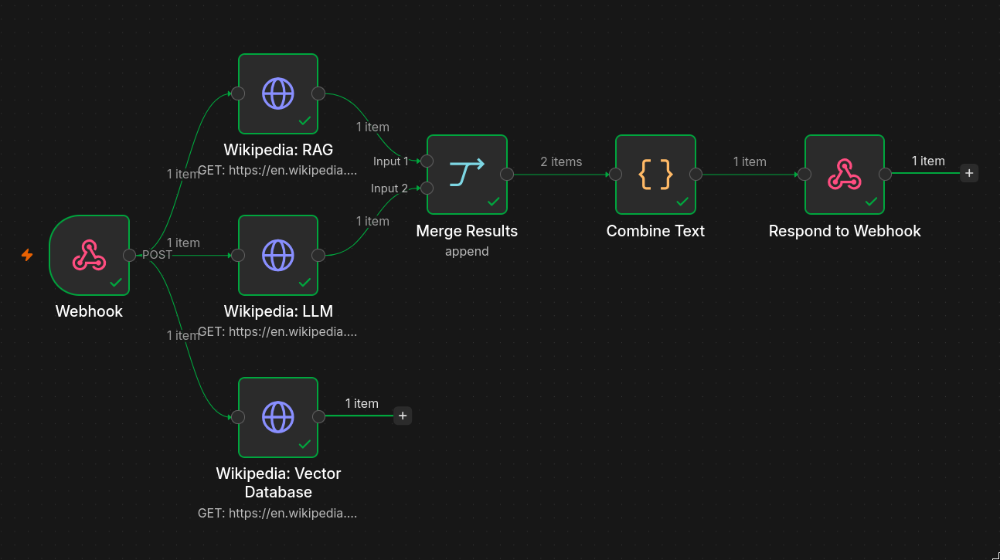

# Lumina Research

Lumina Research is a single-user AI workspace designed to help users process and analyze various inputs such as URLs, PDF documents, and raw notes. The system turns these inputs into reviewable decision reports with citations, draft versions, human approval gates, and a durable workflow history.

## Architecture and Service Communication

The application is built on a modern, decoupled architecture separating the presentation layer from the heavy background computation. 


- **Frontend (Next.js)**: Serves as the user interface and Backend-for-Frontend (BFF). It handles user authentication, session management, and presents the case and report data. It writes user requests and states directly to the database.
- **Backend API (FastAPI)**: A Python-based API that handles core internal requests and acts as an interface for specific system operations.
- **Worker (Python)**: An asynchronous background worker responsible for data ingestion. It fetches source content, parses text, chunks the data, and generates embeddings.
- **Orchestrator (Python / Celery & LangGraph)**: Manages stateful AI workflows. It handles the retrieval of evidence, report synthesis, citation validation, and coordinates human-in-the-loop checkpoints where the system pauses for user review.
- **Data Layer (Supabase & Redis)**: Supabase (PostgreSQL) is the primary source of truth for all application state, while Redis is utilized for task queuing and caching.

**Communication Flow**: 
The Next.js frontend primarily interacts with the Supabase database to read and write application state. The Python workers and orchestrator consume tasks queued in the database and Redis, perform the heavy lifting, and write the results back to the database. The frontend then reads this updated state to present to the user.

## AI Research and Embeddings

The system uses a retrieval-augmented generation approach to create grounded reports:



1. **Ingestion**: When a user adds a source (URL, file, or note), the Python worker fetches and parses the content.
2. **Chunking and Embedding**: The parsed text is broken down into smaller, manageable chunks. The system then generates vector embeddings for each chunk.
3. **Storage**: These embeddings are stored alongside the chunk text in the PostgreSQL database using the pgvector extension for efficient similarity search.
4. **Synthesis**: During an active research case, the orchestrator retrieves the most relevant chunks based on the user's question, synthesizes a draft report, verifies the citations against the stored chunks, and prepares the draft for human review.

## Bring Your Own Key (BYOK)

Lumina Research respects user privacy and control by offering a Bring Your Own Key (BYOK) architecture for AI model providers. 

- Users can configure their own API keys for providers like Gemini and Groq directly within the application settings.
- These keys are encrypted before being stored securely in the database.
- The system allows users to designate specific models for general tasks and optionally specify a separate API key for generating embeddings, or reuse their main provider key.

## Deployment on Cloud Run

The application is designed to be easily deployed on Google Cloud Run using containerization.

- **Containerization**: Each component of the system (Next.js frontend, FastAPI backend, Python Worker, and Celery Orchestrator) is packaged into its own Docker container.
- **Serverless Execution**: Cloud Run provides a fully managed, serverless environment that automatically scales these containers up or down based on incoming traffic and background workload queues.
- **Environment Configuration**: Sensitive variables and configurations, including database connection strings and Redis endpoints, are injected securely into the Cloud Run services at runtime.

## Local Development

### Prerequisites

* **Docker and Docker Compose**
* **Node.js 18+ & npm** (for frontend execution)
* **Python 3.13+** (since services require `>=3.13`)
* **uv** (modern, high-performance Python package and environment manager)
* **Supabase CLI** (optional, for local DB migrations)

### Getting Started

#### Using Docker Compose
1. **Clone the repository:**
   ```bash
   git clone https://github.com/SaptanshuWanjari/Lumina-Research.git
   cd Lumina-Research
   ```

2. **Configure environment secrets:**
   Duplicate the env templates inside `infra/env/` to configure compose variables:

   ```bash
   cp infra/env/.env.example infra/env/.env
   ```
   Edit `infra/env/.env` to fill in Supabase credentials, DB connection, and keys.

3. **Spin up the entire stack:**
   ```bash
   docker compose -f infra/docker/docker-compose.yml up --build
   ```

Ensure you have the necessary environment variables set up in the `infra/env/` directory based on the provided `.example` files.

#### Local Dev (Without Docker Compose)
If you wish to run services individually for faster hot-reloading:

##### 1. Database Setup
Deploy schema migrations to your PostgreSQL/Supabase instance:
```bash
cd supabase

supabase migration up
```

##### 2. Backend (FastAPI)
Synchronize the virtual environment and run the backend service:
```bash
cd services/api

uv sync

uv run uvicorn app.main:app --reload --port 8000
```
##### 3. Workers & Orchestrator (Separate Terminals)
Synchronize and spin up the background worker queues:

```bash
cd services/worker

uv sync

uv run celery -A app.worker worker --loglevel=info
```

```bash
cd services/orchestrator

uv sync

uv run celery -A app.orchestrator worker --loglevel=info
```
##### 4. Frontend
Standard Node server execution:
```bash
cd apps/website

npm install

npm run dev
```
---

### Environment Variables
Copy `infra/env/.env.example` to `infra/env/.env` and fill in:

| Variable | Description |
|------------|------------|
| DATABASE_URL | PostgreSQL connection string |
| SUPABASE_URL | Supabase project URL |
| SUPABASE_SERVICE_ROLE_KEY | Service role key |
| CELERY_BROKER_URL | Redis broker URL |
| GOOGLE_API_KEY | Gemini API key |
| AI_SETTINGS_ENCRYPTION_KEY | Encryption key for stored provider credentials |
| OLLAMA_BASE_URL | Ollama endpoint |

---

### Sample n8n Workflow

A ready-to-use example workflow is included at [`n8n-scraper.json`](./n8n-scraper.json). It fetches Wikipedia summaries for three RAG-related topics (Retrieval-augmented generation, Large language models, and Vector databases) and returns them as a single combined text block.



**Workflow structure:**
```
Webhook → [Wikipedia: RAG, Wikipedia: LLM, Wikipedia: Vector DB]
        → Merge Results → Combine Text → Respond to Webhook
```

**Expected response shape:**
```json
{
  "text": "## Retrieval-augmented generation\n...\n---\n## Large language model\n...",
  "sources": ["https://en.wikipedia.org/wiki/...", "..."],
  "article_count": 3
}
```

### Setting Up n8n Locally

1. **Start n8n via Docker:**
   ```bash
   docker run -it --rm -p 5678:5678 n8nio/n8n
   ```

2. **Import the sample workflow:**
   - Open `http://localhost:5678` in your browser
   - Go to **Workflows → Import from file**
   - Select `n8n-scraper.json` from the project root

3. **Test the webhook** (with the workflow in "Listen for test event" mode):
   ```bash
   curl -s -X POST http://localhost:5678/webhook-test/rag-scraper \
     -H "Content-Type: application/json" \
     -d '{"case_id":"test","source_id":"test"}' | python3 -m json.tool
   ```
   You should see a JSON object with a `text` field containing the article content.

### Using n8n with Cloud-Deployed Lumina (ngrok)

If your Lumina worker is running on Cloud Run (or any cloud environment), it cannot reach `localhost`. Use **ngrok** to expose your local n8n to a public URL:

1. **Install and authenticate ngrok:**
   ```bash
   ngrok config add-authtoken <YOUR_TOKEN>
   ```

2. **Expose n8n:**
   ```bash
   ngrok http 5678
   ```
   ngrok will print a public URL like `https://abc123.ngrok-free.app`.

3. **Construct your webhook URL:**

   | n8n Mode | URL to use in Lumina |
   |---|---|
   | Testing (Listen for test event) | `https://<your-id>.ngrok-free.app/webhook-test/rag-scraper` |
   | Production (Workflow activated) | `https://<your-id>.ngrok-free.app/webhook/rag-scraper` |

4. **Paste that URL** into the **n8n Webhook URL** field when adding a source in Lumina.

> **Note:** On the free ngrok plan, the public URL changes every time you restart ngrok. Update the source URL in Lumina each session, or upgrade to a paid plan for a static domain.

### Writing Your Own n8n Workflow

Your n8n workflow must satisfy these requirements for Lumina to ingest it successfully:

- **Trigger**: A `Webhook` node configured with `POST` method and `responseMode: responseNode`
- **Response**: A `Respond to Webhook` node that returns a JSON body containing at least one of:
  - `text` — plain text or markdown string
  - `content` — string (or a JSON object/array, which Lumina will auto-serialize)
  - `markdown` — markdown string
- **Avoid**: Returning empty responses or HTML. If a step can fail (e.g. scraping a website), add error handling to ensure the workflow always reaches the Respond node.

