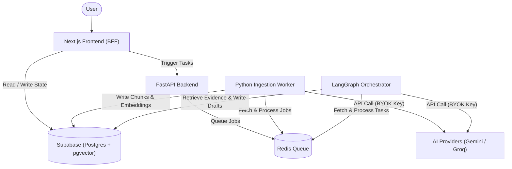
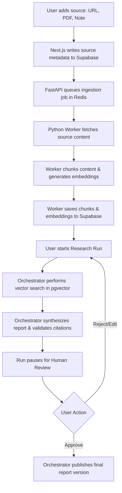

# Lumina Research

Lumina Research is a single-user AI workspace designed to help users process and analyze various inputs such as URLs, PDF documents, and raw notes. The system turns these inputs into reviewable decision reports with citations, draft versions, human approval gates, and a durable workflow history.

## Architecture and Service Communication

The application is built on a modern, decoupled architecture separating the presentation layer from the heavy background computation. 



- **Frontend (Next.js)**: Serves as the user interface and Backend-for-Frontend (BFF). It handles user authentication, session management, and presents the case and report data. It writes user requests and states directly to the database.
- **Backend API (FastAPI)**: A Python-based API that handles core internal requests and acts as an interface for specific system operations.
- **Worker (Python)**: An asynchronous background worker responsible for data ingestion. It fetches source content, parses text, chunks the data, and generates embeddings.
- **Orchestrator (Python / Celery & LangGraph)**: Manages stateful AI workflows. It handles the retrieval of evidence, report synthesis, citation validation, and coordinates human-in-the-loop checkpoints where the system pauses for user review.
- **Data Layer (Supabase & Redis)**: Supabase (PostgreSQL) is the primary source of truth for all application state, while Redis is utilized for task queuing and caching.

**Communication Flow**: 
The Next.js frontend primarily interacts with the Supabase database to read and write application state. The Python workers and orchestrator consume tasks queued in the database and Redis, perform the heavy lifting, and write the results back to the database. The frontend then reads this updated state to present to the user.

## AI Research and Embeddings

The system uses a retrieval-augmented generation approach to create grounded reports:



1. **Ingestion**: When a user adds a source (URL, file, or note), the Python worker fetches and parses the content.
2. **Chunking and Embedding**: The parsed text is broken down into smaller, manageable chunks. The system then generates vector embeddings for each chunk.
3. **Storage**: These embeddings are stored alongside the chunk text in the PostgreSQL database using the pgvector extension for efficient similarity search.
4. **Synthesis**: During an active research case, the orchestrator retrieves the most relevant chunks based on the user's question, synthesizes a draft report, verifies the citations against the stored chunks, and prepares the draft for human review.

## Bring Your Own Key (BYOK)

Lumina Research respects user privacy and control by offering a Bring Your Own Key (BYOK) architecture for AI model providers. 

- Users can configure their own API keys for providers like Gemini and Groq directly within the application settings.
- These keys are encrypted before being stored securely in the database.
- The system allows users to designate specific models for general tasks and optionally specify a separate API key for generating embeddings, or reuse their main provider key.

## Deployment on Cloud Run

The application is designed to be easily deployed on Google Cloud Run using containerization.

- **Containerization**: Each component of the system (Next.js frontend, FastAPI backend, Python Worker, and Celery Orchestrator) is packaged into its own Docker container.
- **Serverless Execution**: Cloud Run provides a fully managed, serverless environment that automatically scales these containers up or down based on incoming traffic and background workload queues.
- **Environment Configuration**: Sensitive variables and configurations, including database connection strings and Redis endpoints, are injected securely into the Cloud Run services at runtime.

## Local Development

### Prerequisites

- Node.js
- Python and UV
- Redis

### Getting Started

Using Docker Compose is the recommended way to run the entire stack locally:

```bash
docker compose -f infra/docker/docker-compose.yml up --build
```

Ensure you have the necessary environment variables set up in the `infra/env/` directory based on the provided `.example` files.
