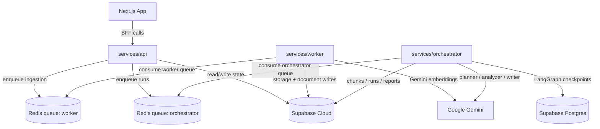

# Backend Architecture & Current Service Notes

This backend is now working against the cloud Supabase project and follows the core rule:

**Supabase stores state. Python computes. Next.js presents.**

## System Overview

## Service Layout

- `services/api`
  - FastAPI app, auth, ownership enforcement, source uploads, run triggers
- `services/worker`
  - Celery ingestion consumer, parsing, chunking, embeddings, indexing
- `services/orchestrator`
  - Celery run consumer, LangGraph workflow, Postgres checkpointing, publish flow

## Current Responsibilities

### `services/api`

- validates Supabase bearer tokens
- creates `cases`, `sources`, and `runs`
- uploads files to Supabase Storage bucket `sources`
- routes Celery tasks explicitly by queue:
  - `worker` queue for ingestion
  - `orchestrator` queue for run/resume

### `services/worker`

- consumes `worker` queue only
- handles `file`, `note`, and `url` sources
- writes `documents`, `chunks`, `ingestion_attempts`
- updates `sources.status` through:
  - `fetching` -> `extracting` -> `chunking` -> `embedding` -> `indexed`

### `services/orchestrator`

- consumes `orchestrator` queue only
- runs LangGraph planner/retriever/analyzer/writer/review/publish
- persists checkpoints to cloud Postgres
- writes `run_steps`, `run_artifacts`, and `report_versions`
- uses LangSmith tracing for root runs and node/model spans

## Important Runtime Constraints

- Cloud schema requires explicit `updated_at` on several inserts; API and orchestrator code now set it where needed.
- Supabase Storage upload options must use string values compatible with the installed client.
- PgBouncer-backed Postgres requires psycopg with `prepare_threshold=None`; the orchestrator checkpointer already enforces this.
- Worker and orchestrator must not share the default Celery queue.

## Implementation State

Completed:

- auth validation
- case/source/run CRUD needed for smoke flow
- worker indexing pipeline
- orchestrator end-to-end run flow
- LangSmith tracing
- cloud Supabase schema compatibility fixes

Remaining work should build on this live baseline rather than the earlier local-only assumptions.
